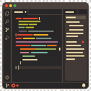
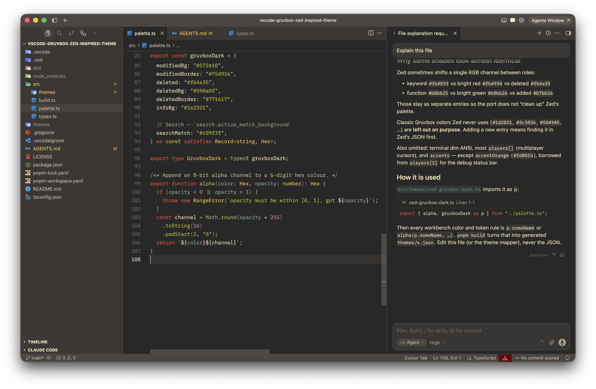

# Zed Gruvbox



Gruvbox for VS Code and Cursor, inspired by the [Zed](https://zed.dev) editor's take on the palette.

Big shoutout to the Zed designers for creating the best dark theme ever.

Currently ships one theme: **Zed Gruvbox Dark**.



## How to install

This extension is not published to the marketplace yet. Install it from a local `.vsix` file:

1. Download [`vscode-gruvbox-zed-inspired-theme-1.0.0.vsix`](https://github.com/egorzekov/vscode-gruvbox-zed-inspired-theme/releases) from [Releases](https://github.com/egorzekov/vscode-gruvbox-zed-inspired-theme/releases).
2. In VS Code or Cursor, open the Command Palette (<kbd>Cmd</kbd>+<kbd>Shift</kbd>+<kbd>P</kbd>) and run **Extensions: Install from VSIX...**
3. Select the downloaded `.vsix` file.
4. Reload the window, then pick **Zed Gruvbox Dark** via **Preferences: Color Theme**.

You can also install from the terminal:

```sh
code --install-extension vscode-gruvbox-zed-inspired-theme-1.0.0.vsix
# or, in Cursor:
cursor --install-extension vscode-gruvbox-zed-inspired-theme-1.0.0.vsix
```

## Additional visual improvements

A few extras that pair well with the theme.

### Lilex

Install the [Lilex](https://github.com/mishamyrt/Lilex) monospace font with Homebrew:

```sh
brew install --cask font-lilex font-lilex-nerd-font
```

Then add something like this to your `settings.json`:

```json
{
  "editor.fontFamily": "Lilex, monospace",
  "editor.fontLigatures": true,
  "editor.fontSize": 14,
  "editor.lineHeight": 1.618,
  "terminal.integrated.fontFamily": "'Lilex Nerd Font Mono', monospace",
  "terminal.integrated.fontSize": 15,
  "terminal.integrated.fontLigatures.enabled": true
}
```

### Material Icon Theme

Install [Material Icon Theme](https://marketplace.visualstudio.com/items?itemName=PKief.material-icon-theme) for file icons in the explorer. In the Extensions view, search for **Material Icon Theme** by Philipp Kief.

## Development

```sh
pnpm install
pnpm build       # generate themes/*.json
pnpm typecheck   # tsc --noEmit
```

To try it live: open this folder in VS Code and press <kbd>F5</kbd> to launch an Extension
Development Host, then pick the theme via **Preferences: Color Theme**. Re-run `pnpm build`
and reload the window after editing colors.

Useful while tuning token rules: **Developer: Inspect Editor Tokens and Scopes** shows the
TextMate and semantic scopes under the cursor.

## Packaging

```sh
pnpm package     # typechecks, builds, emits dist/*.vsix
code --install-extension dist/vscode-gruvbox-zed-inspired-theme-1.0.0.vsix
```

> Requires Node 24+ — the build runs `.ts` files directly via Node's native type stripping.

## License

MIT
